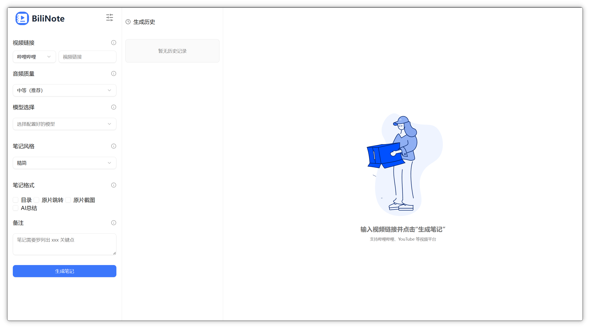

<div style="display: flex; justify-content: center; align-items: center; gap: 10px;
">
    <p align="center">
  
</p>
<h1 align="center" > BiliNote v1.8.1</h1>
</div>

<p align="center"><i>AI 视频笔记生成工具 让 AI 为你的视频做笔记</i></p>

<p align="center">
  
  
  
  
  
  
  
  
</p>

## ✨ 项目简介

BiliNote 是一个开源的 AI 视频笔记助手，支持通过哔哩哔哩、YouTube、抖音等视频链接，自动提取内容并生成结构清晰、重点明确的 Markdown 格式笔记。支持插入截图、原片跳转等功能。

## 📝 使用文档

详细文档可以查看[这里](https://docs.bilinote.app/)

## 体验地址

可以通过访问 [这里](https://www.bilinote.app/) 进行体验，速度略慢，不支持长视频。

## 📦 Windows 打包版

本项目提供了 Windows 系统的 exe 文件，可在[release](https://github.com/JefferyHcool/BiliNote/releases/tag/v1.1.1)进行下载。**注意一定要在没有中文路径的环境下运行。**

## 🔧 功能特性

### 📹 视频平台支持

- **多平台下载**：Bilibili、YouTube、抖音、快手、本地视频
- **灵活扩展**：插件化下载器架构，易于添加新平台支持

### 📝 笔记生成

- **多格式输出**：Markdown（支持导出为 PDF/Word/Notion，开发中）
- **笔记风格**：学术风、口语风、重点提取等多种风格
- **智能截图**：自动截取视频关键帧插入笔记
- **时间戳跳转**：关联原视频，一键跳转到对应时间点

### 🤖 AI 模型

- **转写引擎**：Fast-Whisper、BCut、快手、MLX-Whisper、Groq 等
- **GPT 模型**：OpenAI、DeepSeek、Qwen、自定义模型
- **多模态理解**：支持视频画面与语音联合分析

### 💾 数据管理

- **多版本记录**：保留同一视频的多个笔记版本
- **任务历史**：完整的任务记录与状态追踪
- **本地存储**：SQLite 数据库，支持缓存加速

## 🏗️ 项目架构

```
BiliNote/
├── backend/                    # 后端服务 (FastAPI)
│   ├── app/
│   │   ├── downloaders/        # 视频下载器 (Bilibili/YouTube/抖音/快手)
│   │   ├── transcriber/        # 转写引擎 (Fast-Whisper/BCut/Groq等)
│   │   ├── gpt/                # GPT 提供商 (OpenAI/DeepSeek/Qwen等)
│   │   ├── routers/            # API 路由
│   │   ├── services/           # 核心业务逻辑
│   │   ├── db/                 # 数据库操作
│   │   ├── utils/              # 工具函数
│   │   └── models/             # 数据模型
│   ├── main.py                 # 后端入口
│   └── requirements.txt        # Python 依赖
│
├── BillNote_frontend/           # 前端服务 (React + TypeScript)
│   ├── src/
│   │   ├── components/         # React 组件
│   │   ├── pages/              # 页面组件
│   │   ├── store/              # 状态管理 (Zustand)
│   │   ├── services/           # API 服务
│   │   ├── hooks/              # 自定义 Hooks
│   │   └── utils/              # 工具函数
│   ├── src-tauri/              # Tauri 桌面应用配置
│   └── package.json            # Node 依赖
│
├── doc/                        # 文档资源
├── nginx/                      # Nginx 配置
├── docker-compose.yml          # Docker 部署配置
├── .env.example                # 环境变量模板
└── CLAUDE.md                   # 项目开发指南
```

### 技术栈

| 层级         | 技术                         | 说明                    |
| ------------ | ---------------------------- | ----------------------- |
| **前端**     | React 18 + TypeScript + Vite | 现代化前端框架          |
| **状态管理** | Zustand + persist            | 轻量级状态管理          |
| **UI 组件**  | TailwindCSS + shadcn/ui      | 原子化 CSS + 组件库     |
| **后端**     | FastAPI + Python 3.13+       | 高性能异步 API 框架     |
| **数据库**   | SQLite                       | 轻量级嵌入式数据库      |
| **桌面**     | Tauri 2.x                    | Rust 驱动的桌面应用框架 |
| **部署**     | Docker + Nginx               | 容器化部署方案          |

### 核心流程

```
┌─────────────┐    ┌──────────┐    ┌──────────┐    ┌─────────┐    ┌──────────┐    ┌─────────┐
│  视频链接   │───▶│  下载器  │───▶│ 提取音频 │───▶│ 转写引擎 │───▶│ GPT模型 │───▶│  笔记   │
└─────────────┘    └──────────┘    └──────────┘    └─────────┘    └──────────┘    └─────────┘
                         │                              │              │             │
                         ▼                              ▼              ▼             ▼
                   多平台支持                        本地/云端       多种模型    Markdown
                                                                             存储/展示
```

## 📸 截图预览




## 🚀 快速开始

### 1. 克隆仓库

```bash
git clone https://github.com/JefferyHcool/BiliNote.git
cd BiliNote
mv .env.example .env
```

### 2. 启动后端（FastAPI）

```bash
cd backend
pip install -r requirements.txt
python main.py
```

### 3. 启动前端（Vite + React）

```bash
cd BillNote_frontend
pnpm install
pnpm dev
```

访问：`http://localhost:5173` （前端端口可能因占用而自动切换为 3018 等端口）

### 🐳 使用 Docker 一键部署

确保你已安装 Docker 和 Docker Compose：

[docker 部署](https://github.com/JefferyHcool/bilinote-deploy/blob/master/README.md)

## 📖 开发指南

### 环境要求

- **Python**: 3.13+
- **Node.js**: 18+
- **pnpm**: 最新版
- **FFmpeg**: 必须安装并加入 PATH

### 添加新视频平台支持

1. 在 `backend/app/downloaders/` 创建新的下载器类，继承 `Downloader` 基类
2. 在 `backend/app/services/constant.py` 的 `SUPPORT_PLATFORM_MAP` 注册
3. 更新前端平台图标 `BillNote_frontend/src/components/Icons/platform.tsx`
4. 添加 URL 验证规则 `backend/app/validators/video_url_validator.py`

### 添加新转写引擎

1. 在 `backend/app/transcriber/` 实现继承 `Transcriber` 基类
2. 在 `backend/app/transcriber/transcriber_provider.py` 注册
3. 更新 `.env` 中的 `TRANSCRIBER_TYPE` 选项

### 添加新 GPT 提供商

1. 在 `backend/app/gpt/` 创建新的 GPT 类，继承 `GPT` 基类
2. 在 `backend/app/gpt/gpt_factory.py` 的 `GPTFactory.from_config()` 添加分支
3. 确保数据库 `providers` 表支持该提供商类型

### 代码规范

- **后端**: 遵循 PEP 8，使用类型注解
- **前端**: 使用 ESLint + Prettier
- **提交**: 使用 Conventional Commits 格式

详细开发指南请查看 [CLAUDE.md](./CLAUDE.md)

## ⚙️ 依赖说明

### 🎬 FFmpeg（必需）

本项目依赖 ffmpeg 用于音频处理与转码，必须安装：

```bash
# Mac (brew)
brew install ffmpeg

# Ubuntu / Debian
sudo apt install ffmpeg

# Windows
# 请从官网下载安装：https://ffmpeg.org/download.html
```

> ⚠️ 若系统无法识别 ffmpeg，请将其加入系统环境变量 PATH

### 🚀 CUDA 加速（可选）

若你希望更快地执行音频转写任务，可使用具备 NVIDIA GPU 的机器，并启用 fast-whisper + CUDA 加速版本：

具体 `fast-whisper` 配置方法，请参考：[fast-whisper 项目地址](http://github.com/SYSTRAN/faster-whisper#requirements)

## 🤝 二次开发

本项目采用 **MIT License**，完全支持二次开发和商业使用。

### 允许的操作

- ✅ 自由使用、复制、修改代码
- ✅ 合并到其他项目
- ✅ 发布、分发修改后的版本
- ✅ 用于商业用途
- ✅ 更换许可证（闭源）

### 唯一要求

在所有副本或实质性部分中，保留原作者的版权声明和许可声明。

### 常见二次开发方向

- 添加新的视频平台支持
- 集成更多 AI 模型（如本地 LLM）
- UI 定制和品牌化
- 作为企业内部知识管理工具
- 开发移动端版本

## 🧁 TODO

- [x] 支持抖音及快手等视频平台
- [x] 支持前端设置切换 AI 模型切换、语音转文字模型
- [x] AI 摘要风格自定义（学术风、口语风、重点提取等）
- [ ] 笔记导出为 PDF / Word / Notion
- [x] 加入更多模型支持
- [x] 加入更多音频转文本模型支持
- [ ] 支持批量视频处理
- [ ] 支持视频剪辑功能
- [ ] 移动端 App 开发

### 致谢

- 本项目的 `抖音下载功能` 部分代码参考自：[Evil0ctal/Douyin_TikTok_Download_API](https://github.com/Evil0ctal/Douyin_TikTok_Download_API)
- 感谢所有贡献者和 Star 本项目的用户

---

## 📜 License

MIT License - 详见 [LICENSE](./LICENSE) 文件

---
